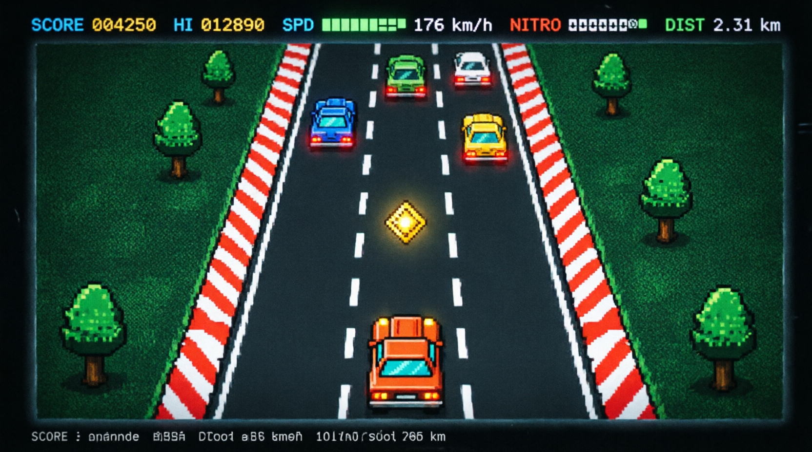

**Rémy the rat has a lead foot. Keep up.**



[](https://www.rust-lang.org)
[](https://ratatui.rs)
[](https://github.com/crossterm-rs/crossterm)
[](#plays-nice-with)
[](#license)

An arcade highway chase that lives entirely inside your terminal — no sprites, no images, no game engine. Every car, tree, explosion and speed-blur is painted cell-by-cell from Unicode block glyphs (`█ ▄ ▀ ▓ ░`) onto a `ratatui` buffer, scrolling at a locked ~120 Hz. Dodge traffic, thread the needle for combo bonuses, pop a nitro canister and watch the cyan flames push you past the speed cap.

> [!TIP]
> Built and tuned for **truecolor** terminals — *kitty*, *wezterm*, *alacritty*, *iTerm2*, Windows Terminal. It still runs anywhere UTF-8 works; you just lose the flame gradients.


» [features](#-what-you-get) · » [controls](#-controls) · » [scoring](#-scoring) · » [difficulty](#-pick-your-poison) · » [quickstart](#-quickstart) · » [under the hood](#-under-the-hood) · » [tinker](#-tinker)

---

## ▌ WHAT YOU GET

Not a menu bolted onto a loop — the whole thing *breathes* before you press a key.

**A living attract screen.** The highway cruises behind the title panel on its own: traffic drifts past, exhaust puffs off the idle car, billboards scroll by (`CHEZ REMY`, `RATATOUILLE!`), and Rémy twitches at the wheel waiting for you.

**Physics with weight.** Throttle and brake have inertia; steering is velocity-based with grip that bleeds off when you let go. Drift onto the grass and you feel it — drag, screen-shake, and a spray of dust until you claw back onto the tarmac.

**Risk that pays.** Squeeze past a car within a single cell and a `+CLOSE!` pops; chain them and the multiplier climbs. The game rewards the line you *shouldn't* take.

**Nitro with a cost.** Grab a gold ◆ to refill the tank, hold <kbd>SPACE</kbd>, and the road streaks — dashed lanes turn to motion lines, the asphalt flickers cyan, and the speedo blows past its redline.

**Juice on every frame.** Mowed-grass stripes, red-white rumble strips, near-miss sparks, a hand-built `3 · 2 · 1 · GO` countdown in block glyphs, and a full-screen explosion with drifting smoke when it all goes wrong.

**Memory between runs.** Per-difficulty high scores persist to disk, and a panic hook guarantees your terminal is always restored — even on a crash.

---

## ▌ CONTROLS

| Do this | Press |
|---|---|
| Steer | <kbd>←</kbd> <kbd>→</kbd> &nbsp;or&nbsp; <kbd>A</kbd> <kbd>D</kbd> |
| Gas | <kbd>↑</kbd> &nbsp;/&nbsp; <kbd>W</kbd> |
| Brake | <kbd>↓</kbd> &nbsp;/&nbsp; <kbd>S</kbd> |
| Nitro *(hold)* | <kbd>Space</kbd> |
| Pause / resume | <kbd>P</kbd> |
| Sound on / off | <kbd>M</kbd> |
| Intensity | <kbd>1</kbd> <kbd>2</kbd> <kbd>3</kbd> &nbsp;or&nbsp; <kbd>←</kbd> <kbd>→</kbd> on the menu |
| Start / retry | <kbd>Enter</kbd> |
| Menu / quit | <kbd>Esc</kbd> &nbsp;/&nbsp; <kbd>Q</kbd> |

> [!NOTE]
> Hold-to-steer works even on terminals that don't emit key-*release* events — input falls back to a short press-window automatically, so it plays fine over plain SSH.

---

## ▌ SCORING

| Source | Points | How it lands |
|---|---|---|
| Cruising | `speed × dt × 0.55` | a passive trickle that rewards going *fast* |
| Near-miss | `+100 + 60 × combo` | pass within ~1 cell, going quicker than them |
| Combo multiplier | `×(1 + 0.25 × combo)` | applied to all passive score; decays after 2.6 s |
| Nitro cruising | `×1.5` | stacked on top while the flames are lit |
| ◆ canister | `+250` | and refills 35 % of the nitro tank |

The loop the game wants you to find: **go fast → thread gaps → grow the combo → spend it on a nitro straight → repeat.**

---

## ▌ PICK YOUR POISON

| # | Mode | Top speed | Traffic | The vibe |
|:-:|---|:-:|---|---|
| <kbd>1</kbd> | **CHILL** | 160 km/h | light | a sunday cruise, mostly |
| <kbd>2</kbd> | **RUSH** | 215 km/h | dense | rush hour with somewhere to be |
| <kbd>3</kbd> | **MAYHEM** | 265 km/h | gridlock | no mercy, no escape lane guaranteed |

Spawn logic always leaves at least one open lane — the chaos is dense, never unfair.

---

## ▌ QUICKSTART

```bash
cargo new terminal-car-racer && cd terminal-car-racer
# drop the provided Cargo.toml and src/main.rs into place, then:
cargo run --release